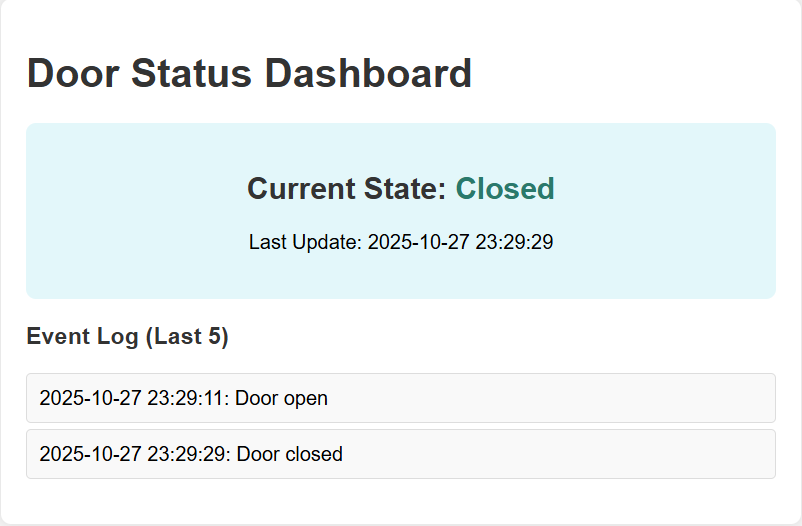

# IMU Door Classifier

This project uses a **Raspberry Pi 5** and an **IMU sensor** (e.g., MPU6050) to detect whether a door is **open**, **closed**, or **idle** using real-time motion data and a **Support Vector Machine (SVM)** model.

The Pi reads IMU data, extracts features (integrated angular displacement from gyro Y-axis), predicts door state with **LibSVM**, and publishes state changes to **AWS IoT Core** via **MQTT**. A web dashboard subscribes to the MQTT topic and displays the door status in real time.

## System Overview

**Components**

* **Raspberry Pi 5** — collects IMU data, performs classification, and publishes MQTT messages
* **IMU (e.g., MPU6050)** — mounted on the door to measure angular velocity (gyro Y-axis)
* **AWS IoT Core** — routes MQTT messages and manages device security
* **Web Dashboard** — subscribes to MQTT to display door state

**Door State Logic**

* `0` — closed
* `1` — open
* `2` — idle / no significant movement

Only state transitions to `open` or `closed` are published (idle states are ignored for publishing).

## Hardware Setup


| IMU | RPi Pin | Function  |
| --- | ------- | --------- |
| VCC | 5V      | Power     |
| GND | GND     | Ground    |
| SDA | GPIO 2  | I²C Data  |
| SCL | GPIO 3  | I²C Clock |

> Ensure the IMU is mounted such that the **Y-axis faces upward**, allowing the gyro Y-axis to track door rotation. The Raspberry Pi 5 is powered via a USB-C power bank for portability.

## Software Workflow

1. **Calibration**

   * Averages gyro Y-axis readings over a user-defined duration (default 3 seconds) to establish an offset
   * Subtracted from future measurements to account for sensor drift
   * Stored in `configs/calibration.json`

2. **Data Acquisition**

   * Reads IMU data at a configurable sample rate (default 50 Hz)
   * Aggregates readings over a configurable window (default 3 seconds)
   * Computes integrated angular displacement (in degrees) as the feature

3. **Feature Extraction & Classification**

   * Integrates calibrated gyro Y readings over the window to calculate total angular change
   * Uses a trained **SVM model** (via [LibSVM](https://www.csie.ntu.edu.tw/~cjlin/libsvm/)) to predict door state
   * Model stored in `configs/model.libsvm`

4. **MQTT Publishing**

   * Sends door state changes ("open" or "closed") to AWS IoT Core topic (default: `door/status`)
   * Uses AWS IoT SDK for secure connection
   * Credentials and certificates stored in `certs/` (not committed to repo; add your own)

5. **Dashboard**

   * A Flask-based web app that subscribes to the MQTT topic and displays real-time status
   * Shows current state, last update timestamp, and event log

   

## Repository Structure

```text
imu-door-classifier/
├── certs/                # AWS IoT certificates (git-ignored files; directory is empty in repo—add your own)
│   ├── AmazonRootCA1.pem
│   ├── AmazonRootCA3.pem
│   ├── door-certificate.pem.crt
│   ├── door-private.pem.key
│   └── door-public.pem.key
├── configs/              # Persistent data (calibration, model, training)
│   ├── calibration.json
│   ├── model.libsvm
│   └── training_data.csv
├── dashboard/            # Web-based dashboard
│   ├── app.py
│   ├── static/
│   │   └── style.css
│   └── templates/
│       └── index.html
├── LICENSE
├── media/                # Images and diagrams
│   ├── dashboard.png
│   └── imu_circuit.png
├── README.md
├── requirements.txt      # All project dependencies
├── src/                  # Core application code (runs on Pi)
│   ├── classifier.py
│   ├── imu_read.py
│   ├── main.py
│   └── mqtt_publisher.py
└── tests/                # Test and debug utilities
    └── aws_test/
        ├── publisher_pi.py
        ├── README.md
        └── receiver.py
```
> Note: The certs/ directory is tracked in the repo but all files inside are ignored via .gitignore for security. You must download your AWS IoT certificates and place them here.

## Installation

1. **Clone the Repository**

   ```bash
   git clone https://github.com/HMC03/imu-door-classifier.git
   cd imu-door-classifier
   ```

2. **Create & Activate Virtual Environment**

   ```bash
   python3 -m venv .venv
   source .venv/bin/activate
   ```

3. **Install Dependencies**

   ```bash
   pip install -r requirements.txt
   ```

4. **Add AWS IoT Certificates**

   * Download from AWS IoT Console:
      * `AmazonRootCA1.pem` (root CA)
      * `door-certificate.pem.crt` (device certificate)
      * `door-private.pem.key` (private key)
   * Place them in `certs/`
   * Optionally add `AmazonRootCA3.pem` or `door-public.pem.key`
   * Update `ENDPOINT` and `CLIENT_ID` in `src/mqtt_publisher.py `and `dashboard/app.py` to match your AWS setup

## Configuration

* **Window Duration**: Change `WINDOW_DURATION` in `src/main.py` (default: 3.0 seconds)
* **Sample Rate**: Adjust `SAMPLE_RATE` in `src/main.py` (default: 50 Hz)
* **MQTT Settings**: Edit `ENDPOINT`, `CLIENT_ID`, `TOPIC` in `src/mqtt_publisher.py` and `dashboard/app.py`
* **Calibration**: Run calibration to generate `configs/calibration.json`

# Dependencies

| Package             | Purpose                                             |
| ------------------- | --------------------------------------------------- |
| `awsiotsdk`         | AWS IoT MQTT connection handling                    |
| `python-dotenv`     | Environment variable management                     |
| `numpy`             | Numeric operations, averaging, feature calculations |
| `smbus`             | I²C communication with IMU                          |
| `libsvm-official`   | SVM training and prediction                         |
| `Flask`             | Web dashboard framework                             |

## Usage

1. **Calibrate IMU**
   ```bash
   python3 src/main.py
   # Choose option 1
   ```

2. **Train SVM Model**
   ```bash
   python3 src/main.py
   # Choose option 2, label windowed features as closed/open/idle
   ```

3. **Run Detection & Publish MQTT**
   ```bash
   python3 src/main.py
   # Choose option 3, door events will print and be sent to AWS
   ```

4. **Run Dashboard**
   ```bash
   cd dashboard
   python3 app.py
   ```
   * Access at http://localhost:5000 (or Pi's IP:5000 on network)
   * Monitors MQTT topic for real-time updates