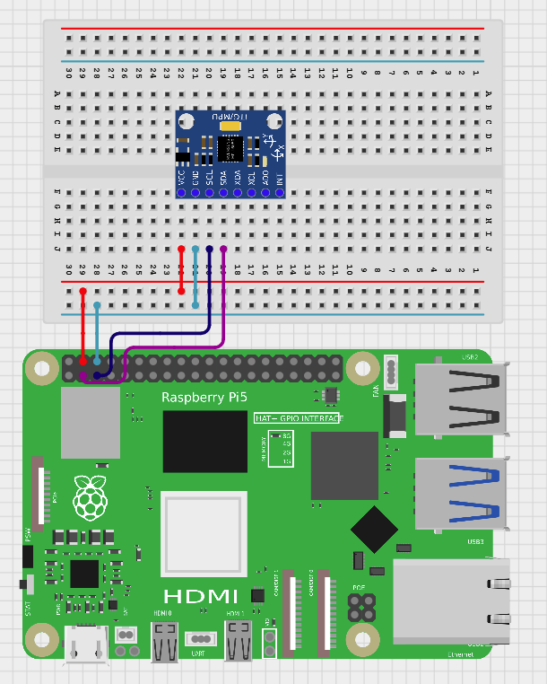

# IMU Door Classifier

This project uses a **Raspberry Pi 5** and an **IMU sensor** to detect whether a door is **open**, **closed**, or **idle** using real-time motion data and a **Support Vector Machine (SVM)** model.

The Pi reads IMU data, extracts features, predicts door state with **LibSVM**, and publishes results to **AWS IoT Core** via **MQTT**. A connected device (web or mobile) can subscribe to the MQTT topic to monitor door status in real time.


## System Overview

**Components**

* **Raspberry Pi 5** — collects IMU data, performs classification, and publishes MQTT messages
* **IMU (e.g., MPU6050)** — mounted on the door to measure angular velocity (gyro Y-axis)
* **AWS IoT Core** — routes MQTT messages and manages device security
* **User Device** — subscribes to MQTT to display door state

**Door State Logic**

* `0` — closed
* `1` — open
* `2` — idle / no significant movement


## Hardware Setup



| IMU | RPi Pin | Function  |
| --- | ------- | --------- |
| VCC | 5V      | Power     |
| GND | GND     | Ground    |
| SDA | GPIO 2  | I²C Data  |
| SCL | GPIO 3  | I²C Clock |

> Ensure the IMU is mounted such that the **Y-axis faces upward**, allowing the gyro Y-axis to track door rotation.

---

## Software Workflow

1. **Calibration**

   * Averages gyro Y-axis readings over a user-defined duration to establish an offset
   * Subtracted from future measurements to account for sensor drift

2. **Data Acquisition**

   * Reads IMU data at a configurable sample rate (default 50 Hz)
   * Aggregates readings over a configurable window (e.g., 2–3 seconds)

3. **Feature Extraction & Classification**

   * Sums calibrated gyro Y readings across the window
   * Uses a trained **SVM model** (via [LibSVM](https://www.csie.ntu.edu.tw/~cjlin/libsvm/)) to predict door state

4. **MQTT Publishing**

   * Sends door state to AWS IoT Core topic (default: `door/status`)
   * Secure credentials read from a local config (not included in repo)

5. **User Interface**

   * External client subscribes to MQTT topic to display door state in real time


## Repository Structure

```text
imu-door-classifier/
├── src/
│   ├── imu_read.py           # IMU data acquisition & calibration
│   ├── classifier.py         # SVM feature handling, prediction, training
│   ├── mqtt_publisher.py     # AWS IoT MQTT publishing
│   └── main.py               # Main menu integrating all modules
├── src/configs/
│   ├── calibration.json      # IMU calibration offsets
│   ├── training_data.csv     # Model training data
│   └── svm_model.pkl         # Trained SVM model
├── media/
│   └── imu_circuit.png       # Wiring diagram
├── requirements.txt
└── README.md
```

## Installation

1. **Clone the Repository**

   ```bash
   git clone https://github.com/<your-username>/imu-door-classifier.git
   cd imu-door-classifier
   ```

2. **Create & Activate Virtual Environment**

   ```bash
   python3 -m venv .venv
   source .venv/bin/activate
   ```

3. **Install Dependencies**

   ```bash
   pip install -r requirements.txt
   ```


## Configuration

* **Window Duration**: Change the `WINDOW_DURATION` variable in `main.py` (default: 3 seconds)
* **Sample Rate**: Adjust `SAMPLE_RATE` in `main.py` (default: 50 Hz)
* **MQTT Credentials**: Store endpoint, client ID, and certificate paths in `src/configs/mqtt_config.json` (not included in repo)


## Dependencies

| Package             | Purpose                                             |
| ------------------- | --------------------------------------------------- |
| `numpy`             | Numeric operations, averaging, feature calculations |
| `libsvm-official`   | SVM training and prediction                         |
| `scipy`             | Required for LibSVM optimization                    |
| `paho-mqtt`         | Optional: MQTT communication (can also use AWS SDK) |
| `awscrt` & `awsiot` | AWS IoT MQTT connection handling                    |


## Usage

1. **Calibrate IMU**

```bash
python3 src/main.py
# Choose option 1
```

2. **Train SVM Model**

```bash
python3 src/main.py
# Choose option 2, label windowed features as closed/open/idle
```

3. **Run Detection & Publish MQTT**

```bash
python3 src/main.py
# Choose option 3, door events will print and be sent to AWS
```